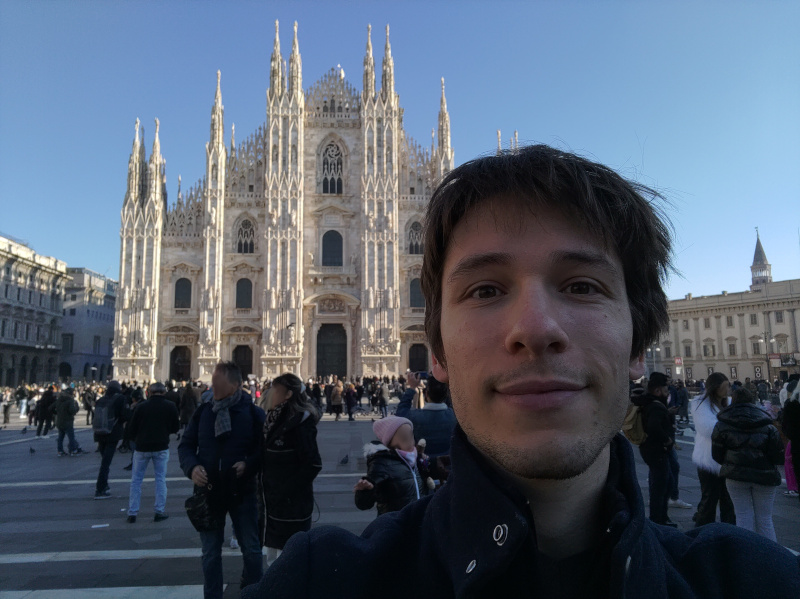

# Homepage

I am now a post-doctoral researcher with [Joel Rybicki](https://rybicki.github.io/) at Humboldt University, Berlin. In 2024, I was working at Bocconi University, Milan, with [Luca Trevisan](https://lucatrevisan.github.io/).

## Thesis

After obtaining a master's degree in theoretical Computer Science in [ENS de Lyon](http://www.ens-lyon.fr/), I have been a PhD student at IRIF from December 2020 to December 2023, under the supervision of [Amos Korman](https://amoskorman.com/) and [Pierre Fraigniaud](https://www.irif.fr/users/pierref/index). For my work during this period, I received the [2024 PODC Doctoral Dissertation Award](https://www.podc.org/dissertation/).

My thesis is called "Algorithmic Perspectives to Collective Natural Phenomena" [(.PDF)](res/thesis.pdf). Some important results are summarized in the [Distributed Computing Column](http://bulletin.eatcs.org/index.php/beatcs/article/view/819) of the EATCS Bulletin n°144.

## Research interests

I investigate the computational power of simple **distributed systems** operating in noisy and unreliable environments. Specifically, I study the feasibility of fundamental problems such as **information spread** and **consensus** among groups of agents with extremely limited capabilities, with a focus on robustness. This often involves studying **discrete stochastic processes** and deriving bounds on their convergence times. The ultimate goal of my research is to gain insights into biological ensembles and, eventually, to better understand natural systems and phenomena. To this end, the settings I consider sometimes incorporate **game theory** in order to account for selfish behaviors.

## Contact information

&emsp; Robin Vacus   
&emsp; Postdoctoral researcher 

&emsp; Department of Computer Science, office IV-13

&emsp; Humboldt University, Berlin, Germany   
&emsp; [On the map](https://www.google.com/maps/place/Humboldt-Universit%C3%A4t+zu+Berlin+Math.+-+Nat.+Fakult%C3%A4t/@52.4293949,13.530383,15z/data=!4m6!3m5!1s0x47a8463aa3589635:0xdfd75ca777f0de1a!8m2!3d52.4293949!4d13.530383!16s%2Fg%2F1tgdmlfh?entry=ttu&g_ep=EgoyMDI1MDEwNi4xIKXMDSoASAFQAw%3D%3D)

&emsp; Email: robin.vacus(at)gmail.com

 
